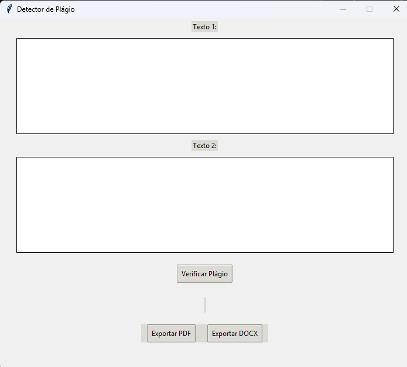
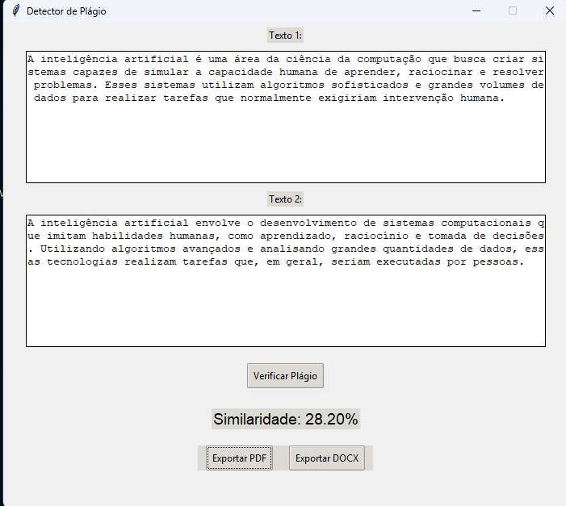

# detector-de-plagio

Este é um aplicativo simples de **detecção de plágio** entre dois textos, com interface gráfica feita em `Tkinter` e suporte para exportação dos resultados em **PDF** e **DOCX**.

---

## ✅ **Funcionalidades**

- Comparação de similaridade textual via **TF-IDF** + **Cosine Similarity**.
- Interface gráfica intuitiva.
- Exportação de resultados para:
  - PDF
  - DOCX (Word)

---

## ✅ **Exemplo de uso**

[](test1.png)

[](test1.png)


---

## ✅ **Como usar**

### 1. Clone ou baixe este repositório.

### 2. Instale as dependências:

```bash
pip install -r requirements.txt
